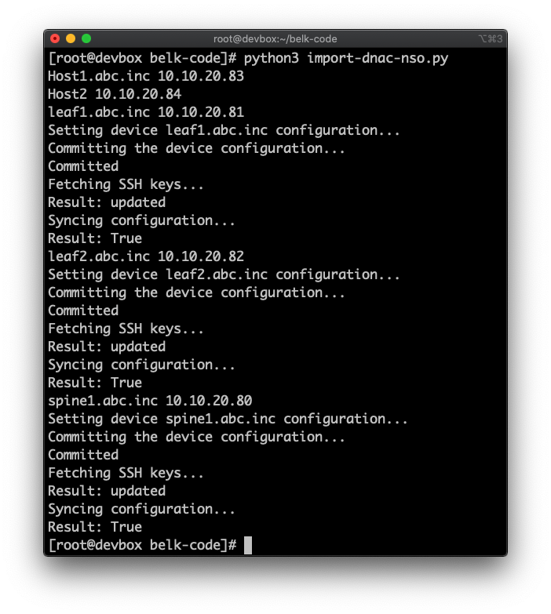
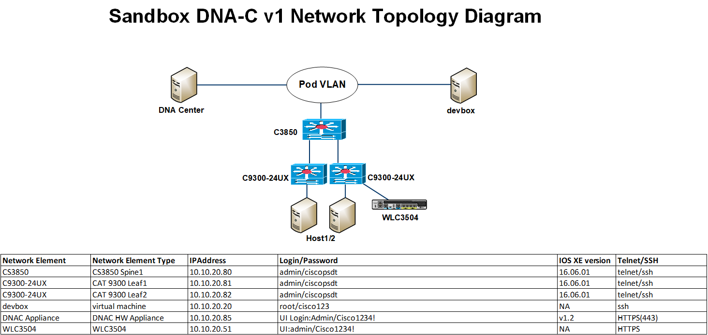

# Import DNA Center Inventory into Cisco NSO

This script uses the [DNA Center Python SDK](https://github.com/cisco-en-programmability/dnacentersdk) and the Cisco NSO Python API to import the inventory of routers and switches from the Cisco DNA Center device list into the Cisco NSO device list. 

In order for NSO to fully import devices, it needs login credentials, which is only available on the reservable Cisco DNA-C Sandbox. Otherwise the script can be demoed with the always on Sandbox, but the device configuration will not be imported. 

 
Here is what the script looks like after it is run:




### Device Topology for Reservable Sandbox

 



## Use Case Description

This project has two main goals:

1. Demonstrate a simple example of using the [DNA Center Python SDK](https://github.com/cisco-en-programmability/dnacentersdk) in conjunction with the Cisco NSO APIs.

2. Provide some sample code if a user currently has Cisco DNA Center in place with a full inventory, but also wants to try Cisco NSO. 

Since Cisco NSO and Cisco DNA Center are both orchestration platforms with different purposes (but both focused on programmability), it can be helpful to see how one interacts with the other.

## Installation

Reserve the [Cisco DNA Center Lab 3](https://developer.cisco.com/site/sandbox/) for Cisco DNA Center 1.2.10. Start your reservation.

Log in to the devbox in the topology and issue the following commands to install NSO and set up the Cisco DNA Center SDK:
#### Set Up Cisco DNA Center SDK
```bash
echo 'export DNA_CENTER_USERNAME=admin' >> ~/.bashrc
echo 'export DNA_CENTER_PASSWORD=Cisco1234!' >> ~/.bashrc
echo 'export DNA_CENTER_BASE_URL=10.10.20.85' >> ~/.bashrc
echo 'export DNA_CENTER_VERIFY=False' >> ~/.bashrc
git clone https://github.com/cisco-en-programmability/dnacentersdk.git
cd dnacentersdk/
python3.6 setup.py install
cd $HOME
git clone https://github.com/jabelk/import-dnac-nso.git
```

#### Set Up NSO

Download the [Cisco NSO binary for Linux](https://developer.cisco.com/docs/nso/). Download the Cisco IOS NED and put in the user home directory, `ncs-5.2.1-cisco-ios-6.39.tar.gz` for example. 
**Download NSO from website to user home directory /root/**
```bash
sudo yum install ant
sh nso-5.2.1.linux.x86_64.signed.bin
sh nso-5.2.1.linux.x86_64.installer.bin  nso-install
echo 'source /root/nso-install/ncsrc' >> ~/.bashrc
source .bashrc
ncs-setup --dest nso-run
tar xf ncs-5.2.1-cisco-ios-6.39.tar.gz
mv cisco-ios-cli-6.39 nso-run/packages
cd ~/nso-run
ncs
ncs_cli -C -u admin
packages reload force
devices authgroups group dnac default-map remote-name admin remote-password ciscopsdt
commit
```

Update NSO Python VM to default to Python3:
```bash
rm $NCS_DIR/bin/ncs-start-python-vm
vim $NCS_DIR/bin/ncs-start-python-vm
```
You could also use nano or some other text editor. 

The file `$NCS_DIR/bin/ncs-start-python-vm` should have the following:
```bash
#!/bin/sh

pypath="${NCS_DIR}/src/ncs/pyapi"
dnacenterpath="/usr/local/lib/python3.6/site-packages"
# Make sure everyone finds the NCS Python libraries at startup
if [ "x$PYTHONPATH" != "x" ]; then
    PYTHONPATH=${dnacenterpath}:${pypath}:$PYTHONPATH
else
    PYTHONPATH=${dnacenterpath}:${pypath}
fi
export PYTHONPATH

main="${pypath}/ncs_pyvm/startup.py"

echo "Starting python -u $main $*"
exec python3 -u "$main" "$@"
```

## Configuration

The following `base_url` can be changed to point to a different Cisco DNA Center
```python
dnac = api.DNACenterAPI(base_url='https://10.10.20.85:443', version='1.3.0')
```

Be sure to update the ENV variables to the corresponding information for your Cisco DNA Center:
```bash
echo 'export DNA_CENTER_USERNAME=admin' >> ~/.bashrc
echo 'export DNA_CENTER_PASSWORD=Cisco1234!' >> ~/.bashrc
echo 'export DNA_CENTER_BASE_URL=10.10.20.85' >> ~/.bashrc
echo 'export DNA_CENTER_VERIFY=False' >> ~/.bashrc
source ~/.bashrc
```


## Usage

The script must be run on a server which is currently running Cisco NSO. The instructions in this guide show how to do it on the devbox in the topology, but other NSO instances could be used. 

After installation is finished, including adding the `dnac` authgroup, run the Python script using `Python3` after changing into the git cloned directory with the script `cd ~/import-dnac-nso`:
```
[root@devbox import-dnac-nso]# python3 import-dnac-nso.py
Host1.abc.inc 10.10.20.83
Host2 10.10.20.84
leaf1.abc.inc 10.10.20.81
Setting device leaf1.abc.inc configuration...
Committing the device configuration...
Committed
Fetching SSH keys...
Result: updated
Syncing configuration...
Result: True
leaf2.abc.inc 10.10.20.82
Setting device leaf2.abc.inc configuration...
Committing the device configuration...
Committed
Fetching SSH keys...
Result: updated
Syncing configuration...
Result: True
spine1.abc.inc 10.10.20.80
Setting device spine1.abc.inc configuration...
Committing the device configuration...
Committed
Fetching SSH keys...
Result: updated
Syncing configuration...
Result: True
[root@devbox import-dnac-nso]#
```

Now the Cisco NSO inventory includes all the network devices from Cisco DNA Center and has the parsed configuration. 
