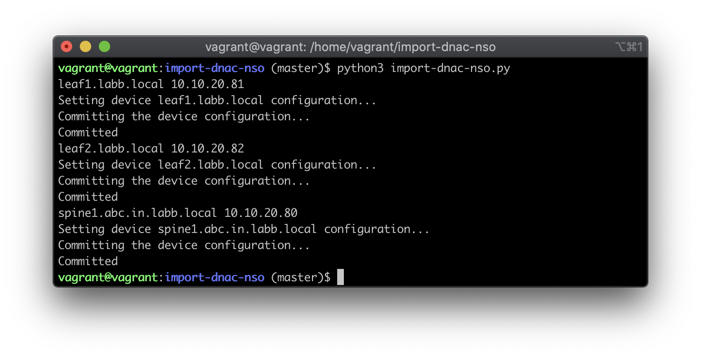
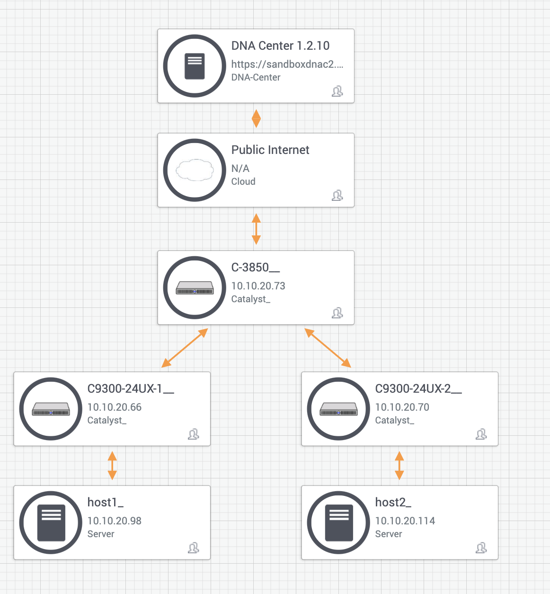
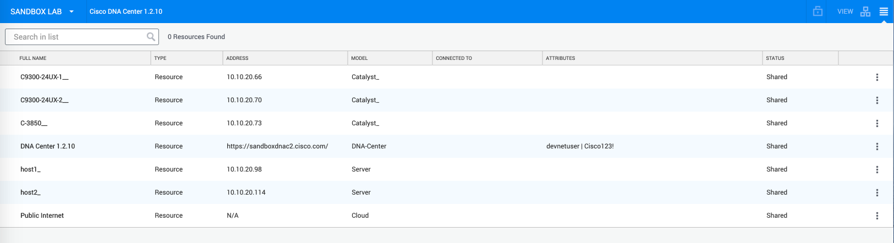

# Import DNA Center Inventory into Cisco NSO
[](https://developer.cisco.com/codeexchange/github/repo/jabelk/import-dnac-nso)
This script uses the [DNA Center Python SDK](https://github.com/cisco-en-programmability/dnacentersdk) and the Cisco NSO Python API to import the inventory of routers and switches from the Cisco DNA Center device list into the Cisco NSO device list. 

In order for NSO to fully import devices, it needs login credentials, which is only available on the reservable Cisco DNA-C Sandbox. Otherwise the script can be demoed with the always on Sandbox, but the device configuration will not be imported. 

 
Here is what the script looks like after it is run:




### Device Topology for Always On Sandbox

 


### Device List for Always On Sandbox




## Use Case Description

This project has two main goals:

1. Demonstrate a simple example of using the [DNA Center Python SDK](https://github.com/cisco-en-programmability/dnacentersdk) in conjunction with the Cisco NSO APIs.

2. Provide some sample code if a user currently has Cisco DNA Center in place with a full inventory, but also wants to try Cisco NSO. 

Since Cisco NSO and Cisco DNA Center are both orchestration platforms with different purposes (but both focused on programmability), it can be helpful to see how one interacts with the other.

## Installation
On your local laptop which follows the [nso-vagrant](https://github.com/NSO-developer/nso-vagrant) installation, or already has Cisco NSO installed. 

```bash

git clone https://github.com/NSO-developer/nso-vagrant
cd nso-vagrant

 *** Download installer and NEDs and put in nso-vagrant/files from https://developer.cisco.com/docs/nso/#!getting-nso   ***

nso-vagrant$ vagrant up

  ***truncated for brevity***

nso-vagrant$ vagrant ssh

  ***truncated for brevity***

vagrant@vagrant:~$ git clone https://github.com/jabelk/import-dnac-nso.git
Cloning into 'import-dnac-nso'...
remote: Enumerating objects: 35, done.
remote: Counting objects: 100% (35/35), done.
remote: Compressing objects: 100% (32/32), done.
remote: Total 35 (delta 11), reused 14 (delta 2), pack-reused 0
Unpacking objects: 100% (35/35), done.

vagrant@vagrant:~$ cd import-dnac-nso/
vagrant@vagrant:import-dnac-nso (master)$ pip install -r requirements.txt
Collecting dnacentersdk

  ***truncated for brevity***

Successfully built future fastjsonschema
Installing collected packages: future, fastjsonschema, certifi, urllib3, chardet, idna, requests, requests-toolbelt, dnacentersdk
Successfully installed certifi-2019.11.28 chardet-3.0.4 dnacentersdk-1.3.0.post6 fastjsonschema-2.14.2 future-0.18.2 idna-2.8 requests-2.22.0 requests-toolbelt-0.9.1 urllib3-1.25.7
```

Now you have NSO and the basics set up, and the Python package dependencies installed. You need to add some additional steps to prep for the script to run. 

Set up a dummy authgroup in NSO:

```
vagrant@vagrant:~$ ncs_cli -C -u admin
admin@ncs# conf
Entering configuration mode terminal
admin@ncs(config)# devices authgroups group dnac default-map remote-name admin remote-password ciscopsdt
admin@ncs(config-group-dnac)# commit
Commit complete.
admin@ncs(config-group-dnac)# end
admin@ncs# exit


```


#### Set Up Cisco DNA Center SDK

Issue the following commands so the SDK can use them to login to DNA-C:

```bash
echo 'export DNA_CENTER_USERNAME=devnetuser' >> ~/.bashrc
echo 'export DNA_CENTER_PASSWORD=Cisco123!' >> ~/.bashrc
echo 'export DNA_CENTER_BASE_URL=https://sandboxdnac2.cisco.com/' >> ~/.bashrc
echo 'export DNA_CENTER_VERIFY=False' >> ~/.bashrc
source .bashrc
```


## Usage

The script must be run on a server which is currently running Cisco NSO in order to access the Cisco NSO Python API. The `nso-vagrant` setup fulfills this purpose. If you use the reservable DNA-Center sandbox, you will also be able to import the device configuration. Since the always on sandbox does not provide device access directly, you are only gathering data from the API. 

After installation is finished, including adding the `dnac` authgroup, run the Python script using `python3` after changing into the git cloned directory with the script `cd ~/import-dnac-nso`:
```
vagrant@vagrant:import-dnac-nso (master)$ python3 import-dnac-nso.py
leaf1.labb.local 10.10.20.81
Setting device leaf1.labb.local configuration...
Committing the device configuration...
Committed
leaf2.labb.local 10.10.20.82
Setting device leaf2.labb.local configuration...
Committing the device configuration...
Committed
spine1.abc.in.labb.local 10.10.20.80
Setting device spine1.abc.in.labb.local configuration...
Committing the device configuration...
Committed
```

Now the Cisco NSO inventory includes all the network devices from Cisco DNA Center.
